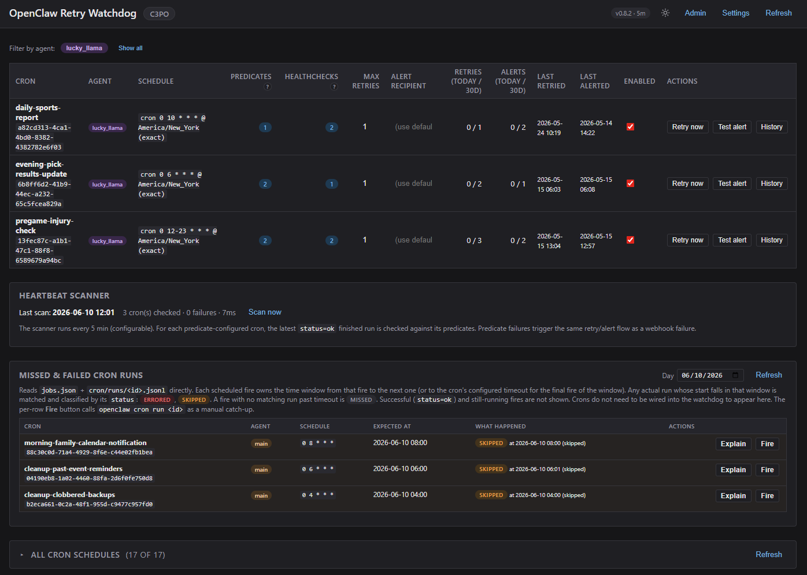
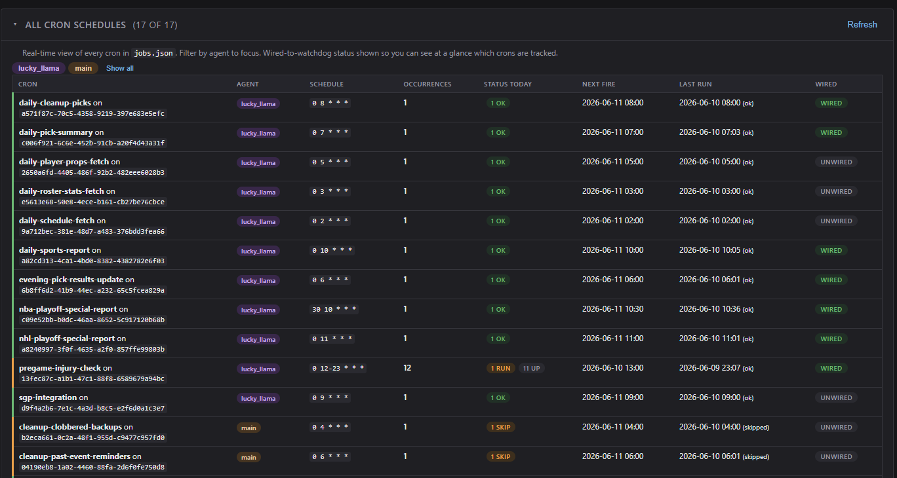
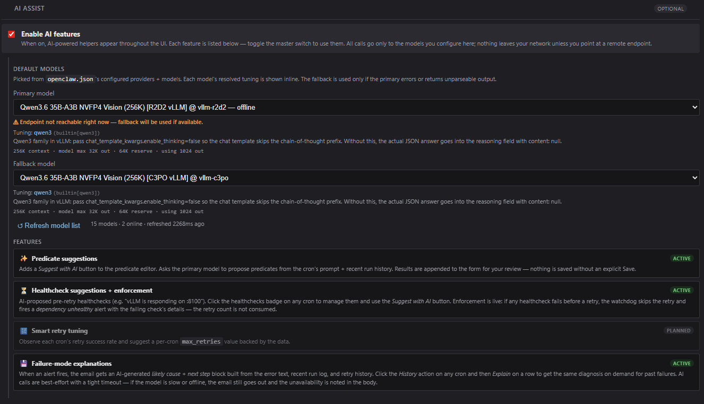
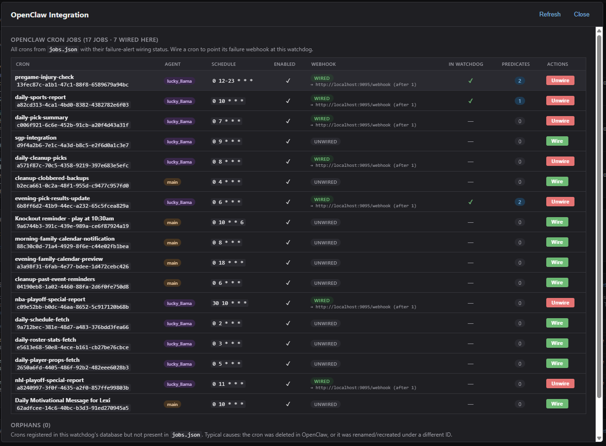
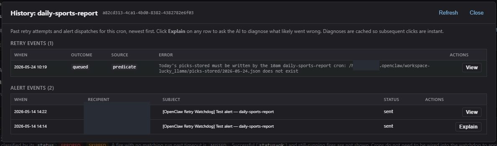
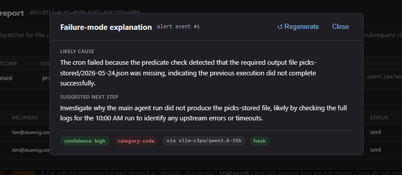

# oc-retry-watchdog

A Python daemon that catches OpenClaw cron failures, retries them, and alerts when retries are exhausted — with **side-effect verification**, **pre-retry dependency healthchecks**, and **AI-assisted configuration** baked in.

OpenClaw's built-in cron scheduler supports failure alerting via webhook but doesn't retry, doesn't verify that "successful" runs actually mutated their expected outputs, and has no concept of upstream-dependency health. Real-world agent crons fail in three distinct ways:

| Failure mode | Native OpenClaw alerts? | Watchdog catches? |
|---|---|---|
| Hard failure (`status=error`, model couldn't respond, timeout) | Yes (webhook) | Yes |
| **Silent success** (`status=ok` but the agent didn't actually do anything) | No | Yes (predicates) |
| **Dependency outage** (model server OOM, upstream API down) | No — retries hammer the dead service | Yes (healthchecks) |

The watchdog provides all three on top of OpenClaw's existing infrastructure, with a JSON HTTP API, a single-page Web UI, and zero non-stdlib Python dependencies.

> **Current version:** v0.8.2 — webhook retry/alert (v0.1), predicate verification (v0.2), full UI + admin + tuning (v0.3–v0.4), healthcheck framework with AI assist + enforcement (v0.5), AI failure-mode explanations on alert emails + on-demand in UI (v0.6), missed-and-failed cron run detection with `jobs.json`-direct read + Fire/Wire one-click actions and a collapsible all-schedules panel (v0.7), **per-row Explain on the missed/failed panel that combines AI failure-mode diagnosis, live healthcheck (dependency) state, and a derived re-fire recommendation (v0.8)**, interval-based fire-to-run matcher + per-status Today's Fires breakdown on the schedules panel (v0.8.2).

## Screenshots — AI-driven status & root-cause investigation

The dashboard is built around one idea: when a cron misbehaves, the operator should know **what happened**, **why**, and **whether to re-fire** without leaving the page. The watchdog reads OpenClaw's own state files (`jobs.json` + `cron/runs/<id>.jsonl`) and synthesises everything below from them — no separate database of "observations" to keep in sync.

### Overview — every cron, current status, one-click actions



Top: the per-cron table — predicates / healthchecks / max retries / today's retry+alert counts / last-retried + last-alerted timestamps. Each row exposes **Retry now**, **Test alert**, and **History** so an operator can intervene mid-incident without SSH or shell.

Middle: heartbeat scanner status — confirms the predicate sweep is alive and reports the last scan duration.

Bottom: the **Missed & failed cron runs** panel. Reads `jobs.json` directly so crons don't have to be wired into the watchdog to appear here. Each scheduled fire is matched against actual run records using an interval-based matcher (each fire E owns `[E − lead_tol, next_E)` or for the final fire `[E − lead_tol, E + timeout + cushion]`) — this accommodates real-world scheduler queue delay, which is common when agent crons take minutes to start. The badge palette is consistent across the whole UI: `ERRORED` (red), `SKIPPED` (amber), `MISSED` (muted). Successful and still-running fires are filtered out — only things that need attention appear.

### All cron schedules — at-a-glance status of every fire today



Real-time view of every cron in `jobs.json`, agent-filterable. Two columns answer two different questions:

- **Occurrences** = how many times this cron is scheduled to fire today.
- **Status today** = what has *actually* happened to each of those fires so far — the same `ok` / `err` / `skip` / `miss` / `run` / `up` breakdown chips used by the missed/failed panel above, computed by the same matcher.

A 3-px coloured row border (green / amber / red / muted) sums the row's day-status so the table reads at a glance: green rows are healthy, red rows demand attention.

### AI Assist — pluggable models, per-feature toggles



Models come from OpenClaw's own `openclaw.json` provider list — point at any OpenAI-compatible endpoint (vLLM, Ollama, llama.cpp, Anthropic via gateway, etc.). The dropdown surfaces each model's reachability with a live `online` / `offline` indicator, and the resolved tuning profile (e.g. `qwen3`-family chat-template kwargs to suppress chain-of-thought leakage into the JSON output) is shown inline so the operator can see *which knobs apply* before any token is spent.

Three discrete AI-powered features ride on this:

- **Predicate suggestions** — given a cron's prompt + recent run summaries, propose post-success predicates (file-mtime, file-grew, JSON-key-equals, etc.) so silent successes get caught.
- **Healthcheck suggestions + enforcement** — propose pre-retry dependency checks (HTTP probes, file freshness, etc.). At retry time the watchdog evaluates them; if any fails the retry is skipped and a *dependency unhealthy* alert fires instead of hammering a dead service.
- **Failure-mode explanations** — see below.

All calls are best-effort with a tight per-call timeout: a slow or offline model never blocks the alert path.

### OpenClaw integration — wire crons in or out from the UI



Lists every cron in `jobs.json` with its failure-alert wiring state. One-click **Wire** sets the cron's failure-alert webhook at this watchdog (`openclaw cron edit ... --failure-alert-mode webhook`); **Unwire** removes it. The In-Watchdog column shows which crons we've already seen failures for. The Predicates column shows how many post-success checks are configured per cron. No CLI required for normal operations.

### History — every retry + every alert, with on-demand AI diagnosis



Per-cron forensics. Retry events show outcome (`queued`, `declined-disabled`, `declined-dependency-down`, `declined-over-limit`, `declined-error`) so the operator can tell *why* a retry didn't fire — vs. just whether one did. Alert events show recipient + subject + delivery status. Every row exposes an **Explain** button.

(Email recipient and one path-username segment have been redacted in this public screenshot.)

### Failure-mode explanation — AI cause + next step + category



Click **Explain** on any retry, alert, or missed/failed row and the watchdog feeds the error text + recent run-log tail + retry history + cron prompt context to the configured model and asks for a structured JSON response: `cause`, `next_step`, `confidence`, `category`. The category (`model` / `network` / `config` / `data` / `code` / `dependency` / `unknown`) drives a re-fire recommendation:

| Category | Default recommendation |
|---|---|
| `model` | Re-fire — usually transient. |
| `network` | Verify upstream reachability, then re-fire. |
| `config` | **Don't re-fire** — fix config first; the error will repeat. |
| `data` | Inspect input before re-firing. |
| `code` | **Don't re-fire** — deploy fix needed. |
| `dependency` | Wait for the dependency to recover, then re-fire. |
| `unknown` | Review diagnosis + healthcheck state, decide. |

The modal also evaluates the cron's currently-configured healthchecks at click-time. If any are *currently* failing, the recommendation is overridden to *"don't re-fire until the dependency recovers"* — a known-failing dependency is more authoritative than a model's guess.

Diagnoses are cached per event so repeat clicks are instant; a **Regenerate** button forces a fresh call when the operator suspects the cached diagnosis is stale.

## Architecture

```
                   ┌───────────────────────────────────────────────┐
  openclaw-gateway │  retry-watchdog daemon  (Python 3.11+, stdlib)│
  failure webhook  │                                               │
       ────────────▶ POST /webhook                                 │
                   │   1. Healthcheck eval (pre-retry)             │
                   │       ├─ pass → retry OR alert                │
                   │       └─ fail → "dependency unhealthy" alert  │
                   │                  (retry budget NOT consumed)  │
                   │   2. Retry decision (max_retries gated)       │
                   │   3. Alert via gog-send / any CLI sender      │
                   │                                               │
  background scanner│ Predicate scanner (every 5min)               │
  every N minutes  │   For each new status=ok run:                 │
                   │     evaluate side-effect predicates           │
                   │     fail → synthetic failure → retry/alert    │
                   │                                               │
                   │ AI Assist (optional, opt-in)                  │
                   │   POST /api/crons/<id>/predicates/suggest     │
                   │   POST /api/crons/<id>/healthchecks/suggest   │
                   │     → calls an OpenClaw-configured model      │
                   │     → returns proposed JSON rules             │
                   │     → operator reviews + saves                │
                   │                                               │
                   │ SQLite history + JSON HTTP API + Web UI       │
                   └───────────────────────────────────────────────┘
```

## Smart features

### 1. Webhook → retry → alert (v0.1)

The baseline workflow: OpenClaw posts `/webhook` on each cron failure, the watchdog calls `openclaw cron run <id>` up to `max_retries` times per day, and emails the configured recipient when the limit is hit.

Why this matters: most cron failures in agent-driven setups are transient (model produced no completion, upstream API hiccup, dependency busy) and one retry typically clears them. OpenClaw natively can alert but not retry, so a single transient blip burns a slot in the operator's inbox even when a 5-second retry would have fixed it.

### 2. Predicates — side-effect verification on success (v0.2)

OpenClaw cron failures don't always show up as `status=error`. The most common subtle failure mode in real-world agent setups is **silent success**: the agent reports `status=ok` with a confident narrative summary, but didn't actually invoke its tools, didn't write the output files, didn't update the database. The webhook stays quiet; the operator finds out hours later when downstream consumers fail.

After every `status=ok` cron run, a background scanner evaluates per-cron **predicates** against the filesystem and HTTP endpoints to verify the cron actually did its work. If any predicate fails, the same retry-or-alert flow kicks in (with `failure_source = predicate` in the audit trail).

Predicate types:

| Type | Asserts |
|---|---|
| `file_mtime` | File at `path` has mtime within `max_age_minutes`. Optional `min_size_bytes`. |
| `file_grew` | File size strictly increased since the last scan (state tracked in SQLite). |
| `json_field_count` | Load JSON, count list items where `field` matches a filter (`non_null` / `null` / `{equals:X}` / `{in:[...]}`), assert `count_min` / `count_max` bounds. |
| `http_health` | GET a URL, assert response status code matches `expected_status` (default 200). |

Path placeholders: `{TODAY}` / `{YESTERDAY}` resolve to `YYYY-MM-DD` in the configured timezone at evaluation time.

Example for a daily grading job:

```json
"predicates": {
  "<grading-cron-uuid>": [
    {
      "type": "file_mtime",
      "path": "/data/picks/{YESTERDAY}.json",
      "max_age_minutes": 60,
      "description": "Yesterday's picks file must have been touched within the last hour"
    },
    {
      "type": "json_field_count",
      "path": "/data/picks/{YESTERDAY}.json",
      "field": "result",
      "filter": "non_null",
      "count_min": 1,
      "description": "At least one pick must have a graded result"
    }
  ]
}
```

### 3. Healthchecks — pre-retry dependency verification with enforcement (v0.5)

When OpenClaw's cron fires its failure webhook, the watchdog wants to retry — but if the cron's upstream dependency is down, the retry will fail just like the original and burns a slot in the alert pipeline for no useful signal.

Pre-retry **healthchecks** address this. They use the same schema as predicates (same four types), but they run *before* a retry decision, not after a successful run. If any healthcheck fails, the watchdog:

1. **Skips the retry entirely.** No `openclaw cron run` invocation.
2. **Sends a distinct alert.** Subject becomes `<cron> — dependency unhealthy`, body includes which check failed and why.
3. **Does not consume the retry budget.** A down dependency isn't the cron's fault — the cron stays eligible for its normal `max_retries` once the dependency recovers.

When the dependency comes back, the next failure of the same cron resumes normal retry behavior. The budget wasn't burned during the outage.

Example healthchecks for a cron that calls a vLLM endpoint and an external API:

```json
"healthchecks": {
  "<cron-uuid>": [
    {
      "type": "http_health",
      "url": "http://localhost:8100/v1/models",
      "timeout_seconds": 3,
      "description": "vLLM endpoint must be responding before we retry"
    },
    {
      "type": "http_health",
      "url": "https://site.api.espn.com/apis/site/v2/sports/baseball/mlb/scoreboard",
      "timeout_seconds": 5,
      "description": "ESPN scoreboard API must be reachable"
    }
  ]
}
```

`http_health` is the right choice ~95% of the time for healthchecks. The other predicate types are available but rarely appropriate (you're checking service uptime, not file mutation).

### 4. AI Assist — model-suggested predicates + healthchecks (v0.4+)

Writing predicates and healthchecks by hand requires understanding both the cron's outputs and its dependencies. The watchdog can read OpenClaw's `openclaw.json` to discover configured LLM providers and use **one of them** (operator-selected) to propose rules based on the cron's prompt + recent run history. Disabled by default; opt-in via Settings.

Flow:

1. Operator opens Settings → enables AI → picks Primary + Fallback models from a dropdown populated by `openclaw.json`'s providers
2. Operator clicks the predicate or healthcheck badge on any cron → opens the editor
3. Clicks **✨ Suggest with AI** → daemon calls the chosen model with the cron's metadata and a system prompt tailored to the kind of rules being requested
4. Returned predicates are **appended** to the form (existing rules preserved)
5. Operator reviews, edits, tests with the per-card **Test** button (see below), saves

The system prompt is strict — JSON-only output, explicit anti-patterns (no `file_mtime` on script files for healthchecks, etc.), few-shot examples. Returns `[]` if the model judges the cron has no obvious external dependencies rather than inventing placeholders.

**Privacy:** all AI calls go to the OpenAI-compatible endpoint the operator picked. If that's a local vLLM, the cron's prompt never leaves the operator's network.

#### Per-model tuning registry

Different LLM families need different knobs to produce clean JSON. The watchdog ships with a built-in tuning registry in [`ai.py`](ai.py) that matches model IDs against family patterns and applies appropriate request-body knobs automatically:

| Family pattern | Knob | Why |
|---|---|---|
| `qwen3.*` | `chat_template_kwargs: {enable_thinking: false}` | Disables Qwen3 chain-of-thought; otherwise the response goes into `reasoning` with `content: null` |
| `qwen2.*` | (default) | No thinking mode; standard chat completions |
| `gpt-oss / gpt-N / o1 / o3` | `response_format: {type: "json_object"}` | OpenAI-compat JSON mode |
| `deepseek*` | `response_format: {type: "json_object"}` | Same |
| `glm*` | `system_prompt_prefix: "/no_think\n\n"` | GLM honors `/no_think` text directives |
| `gemma*`, `mistral*`, `nemotron*` | (default) | No special directives needed |

Operators can override per-model via `ai.tunings` in `config.json`:

```json
"ai": {
  "tunings": {
    "vllm-c3po/qwen3.6-35b": {
      "temperature": 0.2,
      "max_tokens": 2048
    }
  }
}
```

Inherits remaining knobs from the matching built-in family rule. See `GET /api/ai/tunings` for the full active registry.

#### Model availability + offline handling

`GET /api/ai/models` parallel-pings each provider's `/v1/models` endpoint (2s timeout) and annotates each with `online: bool`. The Settings dropdowns surface offline entries with `— offline` in the label, and the tuning-info area below shows an amber warning if the currently-selected model is unreachable.

During an actual suggest call, the watchdog pre-checks reachability (3s timeout) before invoking the chat endpoint — so an offline primary model fails fast (~3s) and the fallback runs immediately, instead of burning the chat timeout (~30s) on the dead host.

#### Context-budget awareness

For each model in the dropdown, the watchdog reads:

- `contextWindow` and `maxTokens` from `openclaw.json` (per-model)
- `agents.defaults.compaction.reserveTokens` (with per-agent overrides if any)

It displays the effective budget beneath the dropdown:

```
262K context · model max 32K out · 64K reserve · using 1024 out
```

And clamps the actual `max_tokens` for the chat call at the model's declared ceiling, so the daemon never asks for more output than the model can produce regardless of what the operator typed.

#### Per-card Test button

Each predicate / healthcheck card in the editor has a **Test** button that dry-runs the rule against the daemon and shows the result inline (`✓ ok (200)` / `✗ ... HTTP 404`) without saving. Catches placeholder URLs, hallucinated endpoints, wrong paths, and 401-on-root cases immediately — before they silently block retries in production.

### 5. Failure-mode explanations — AI diagnosis on alerts + on-demand (v0.6)

When an alert email is about to fire (max retries exhausted, or a dependency-down decline), the watchdog asks the configured AI model for a one-paragraph diagnosis and injects it into the email body before the raw error wall:

```
AI diagnosis:
  Likely cause: vLLM endpoint at http://c3po:8100/v1 returned HTTP 504 — the model server is overloaded or out of memory.
  Next step:    Check `nvidia-smi` on C3PO and restart the vLLM systemd service if VRAM is pinned.
  Confidence:   medium (model)
```

The AI input includes the cron's metadata, the error text from the failed run, the tail of the cron's most recent run log, the recent retry history (to spot patterns), and the cron's resolved model endpoint (so the AI can spot wired-to-the-wrong-host cases).

**Best-effort with explicit unavailability.** The diagnosis call has a tight 8-second timeout (configurable, capped at 15s) so a slow or offline model never delays the alert email. If both primary and fallback fail, the email still sends — and the body explicitly says so:

```
AI diagnosis: unavailable -- primary endpoint unreachable | fallback model not found in openclaw.json
```

This way the operator can distinguish "AI was tried and failed" (something to investigate) from "AI is simply off" (configuration choice).

**Run-log excerpt.** Whether or not AI succeeded, the tail of the cron's most recent run log is appended to the email so the operator has the raw context they'd otherwise need to SSH in to fetch.

**Cached explanations + on-demand UI.** Every diagnosis is stored in the `explanations` table keyed by `(event_kind, event_id)`. The cron card has a **History** action button that opens a modal listing all past retry and alert events; each row has an **Explain** button:

- First click → fires `POST /api/crons/<id>/history/<kind>/<event_id>/explain`, which calls the AI and caches the result.
- Subsequent clicks → instant "View" load from the cache (no AI call).
- A **Regenerate** button in the explanation modal forces a fresh call when needed.

The diagnosis modal renders the cause, next step, a confidence badge (`high` / `medium` / `low`), a category badge (`model` / `network` / `config` / `data` / `code` / `dependency` / `unknown`), the model that produced it, and a `cached` / `fresh` indicator.

**What the model is asked to output.** Strict JSON object schema:

```json
{
  "cause":      "ONE concise sentence — likely root cause of THIS failure",
  "next_step":  "ONE concise sentence — concrete action the operator should take next",
  "confidence": "low" | "medium" | "high",
  "category":   "model" | "network" | "config" | "data" | "code" | "dependency" | "unknown"
}
```

The system prompt embeds diagnostic signals (e.g. "ModelProviderError / empty payload / stopReason=length → model issue", "repeated identical failures → systemic, not transient") so the model anchors on observable signals rather than generic SRE prose. Parser is strict — malformed responses are treated as a failure and the email gets the "unavailable" note.

### 6. Missed-and-failed cron run detection (v0.7)

A "Missed & failed cron runs" panel in the main dashboard reads `jobs.json` + `cron/runs/<id>.jsonl` directly and reports every expected fire time on the selected day that did NOT produce a `status=ok` run within ±5 min. Crons do **not** need to be wired into the retry-watchdog to appear — this is purely a filesystem-state view of OpenClaw's own cron records.

Each row is one expected fire time, categorized:

- **missed** — no run record exists in the ±5 min window around the expected fire. The cron didn't run at all (host down, gateway down, missed schedule).
- **errored** — at least one run exists in the window, but ALL of them have status != ok. The cron fired but failed.

If a single run within the window succeeded, the expected fire is treated as cleanly handled and does not appear, even if other tries in the window failed.

The panel defaults to **today** but accepts any date via the picker — useful for retroactively reviewing a day you weren't watching. The per-row **Fire** button calls `openclaw cron run <id>` as a one-shot manual catch-up; once the new run lands and is `status=ok`, the row falls off the list on the next refresh. This is a one-shot operator action, NOT a retry-event in the watchdog's history — the regular retry flow only kicks in when the cron is wired.

#### Errored-but-unwired surfacing (the "you should wire this" hint)

When the panel sees a cron erroring on a fire time, AND that cron's failure-alert webhook is NOT pointed at this watchdog, the row gets a `not watched` badge and an extra **Wire** button. One click wires the cron to the watchdog so future failures get tracked and retried per the configured policy. This was added because the dashboard owner shouldn't have to find out manually that a cron has been silently failing — if it shows up errored here, the watchdog should offer the path to start watching it.

#### Per-row Explain (v0.8)

Every row in the missed/failed panel gets an **Explain** button that opens a modal combining three signals:

1. **AI failure-mode diagnosis** — for errored rows, runs the actual run record's error/summary text through the AI explainer (same path as alert-time enrichment from v0.6). Returns cause + next-step + confidence + category, same schema. For missed rows (no run record), the modal returns a structured "AI can't diagnose silence" note with the common categories of cause (host down, gateway down, schedule recently changed, etc.) so the operator has a checklist to investigate.

2. **Dependencies** — every healthcheck configured for the cron is evaluated *now* and rendered with its current pass/fail state and the predicate's actual message. If no healthchecks are configured, the modal explicitly nudges that adding them gates retries on dependency state.

3. **Re-fire recommendation** — derived from the AI category, *adjusted by* current healthcheck state. The category-to-advice mapping looks like this:

| AI category | Default advice | Override if any healthcheck is failing |
|---|---|---|
| `model` | Re-fire now — model-side errors are usually transient | Don't re-fire; fix dependency first |
| `network` | Verify upstream reachable, then re-fire | Don't re-fire; fix dependency first |
| `config` | Don't re-fire — config issue will repeat | Same |
| `data` | Inspect input data first | Same |
| `code` | Don't re-fire — needs deploy or workaround | Same |
| `dependency` | Wait for recovery, then re-fire | Same; the failing healthcheck IS the dependency |
| `unknown` | Review + decide | Don't re-fire if any healthcheck is failing |

A failing healthcheck *always* overrides the AI's category-derived advice to "fix dependency first," because a known-failing dependency is more authoritative than a model's guess at what went wrong.

### 7. All cron schedules panel (v0.7)

A collapsible "All cron schedules" panel under the missed-runs section. Reads `jobs.json` real-time on each open/refresh and lists every cron with:

- Name + ID
- Agent (with the same color-chip styling as the main table)
- Schedule expression
- Today's expected fire count (with hover-to-see-all)
- Next upcoming fire time (within a 7-day lookahead)
- Last actual run + status
- Wired-to-watchdog status

Agent filter chips along the top toggle which agents are visible; selection persists in localStorage. Disabled crons stay in the list but are dimmed so the operator can see "what's configured but inactive" at a glance.

The panel is **collapsed by default** so the load is cheap on initial page render. Expand it once and it auto-loads; manual Refresh button at the top right refreshes without re-collapsing.

### 8. Admin view — OpenClaw integration management (v0.3)

A separate `Admin` modal reads `openclaw.json`'s job list and surfaces:

- **Every cron in OpenClaw** (not just the ones the watchdog has seen) with its current `failure-alert` wiring status:
  - `wired` (green) — webhook points at this watchdog
  - `other` (amber) — webhook configured but to a different URL
  - `unwired` (gray) — no failure-alert configured
- One-click **Wire** / **Unwire** buttons that invoke `openclaw cron edit ... --failure-alert-mode webhook ...` via subprocess
- Auto-registration of newly-wired crons in the watchdog DB (with metadata refreshed from `openclaw cron show`)
- An **Orphans** section listing crons in the watchdog DB but not in `openclaw.json` (typical causes: cron deleted in OpenClaw, or recreated under a new UUID). Remove button deletes from the DB and strips any predicate/healthcheck config.

## Roadmap — what hasn't shipped yet

The Smart features list above is what's running today. A few items from the original design remain unbuilt:

### ~~Missed-run detection~~ — **shipped in v0.7**

Originally scoped for v0.3 alongside the predicate scanner; landed in v0.7.0 (2026-06-10) as the **Missed-and-failed cron runs** dashboard panel. See [feature 6 above](#6-missed-and-failed-cron-run-detection-v07). The v0.7 shape is somewhat different from the original v0.3 design — it's a read-only viewer with manual Fire/Wire one-click actions rather than an automatic retry-flow trigger. That ended up being the right scope: silent-missed-fire detection is a separate concern from the existing webhook-driven retry logic, and surfacing it as an operator-reviewed list keeps the semantics clean. The stdlib cron-expression parser (`cron_parser.py`) lives in the repo if anyone wants to build the auto-trigger variant later.

### Smart retry tuning

Marked **planned** in the Settings UI feature list. The idea: observe each cron's retry success rate over time and suggest a per-cron `max_retries` value backed by the data (e.g. "this cron has succeeded on retry 7/8 times in the last 30 days — consider raising max_retries from 1 to 2"). Today `max_retries` is operator-set with no data behind the choice.

Status: not implemented. The underlying `retry_events` table already stores everything needed; this is purely an analysis + UI surface.

### Failure-mode explanation categories beyond the seven built-in

The v0.6 explanation schema constrains `category` to `model | network | config | data | code | dependency | unknown`. Real-world failures sometimes don't fit cleanly into any of those. No plan to extend yet — operators have flagged a handful of edge cases (e.g. WhatsApp session logout being categorized as `config` when `dependency` would arguably fit better) but the seven categories have held up well enough in practice that adding more risks AI inconsistency. Tracked here so contributors don't propose this without context.

### Things considered and rejected

- **Multi-channel alerts** (Slack, WhatsApp, Pushover). The CLI-sender abstraction (`alert.sender_binary`) means an operator can already point at any sender that accepts `--account / --to / --subject / --body` — multi-channel doesn't need a code change, just configuration. Keeping the watchdog email-only by default.
- **Auth on the daemon.** Trust-via-network-ACL (Tailscale, VPN) is the deliberate threat model. Adding shared-secret auth or basic auth on the UI is a one-evening change if the threat model ever shifts; not adding it speculatively.
- **Prometheus exporter / metrics endpoint.** The `/api/heartbeat` and `/api/crons` endpoints already expose everything a sidecar exporter would need; not adding a second representation in-process.

## Web UI

Single-page UI at the daemon's port (default 9095). Themed light/dark mode (system-preference + override; persisted in localStorage). Responsive: full table view on desktop, automatic card layout on phones.

| Surface | Function |
|---|---|
| **Header pill** | Version + uptime; instance name (operator-configurable, e.g. `C3PO`) when set |
| **Theme toggle** | Sun/moon — flips light/dark, persists |
| **Settings modal** | Default alert recipient, default max retries, AI-assist enablement + model picks |
| **Admin modal** | OpenClaw integration overview, wire/unwire actions, orphan cleanup |
| **Filter by agent** | Toggle chips per agent — hides rows of agents you don't want to see right now |
| **Cron table** | Per-cron: schedule, agent (colored chip), predicates badge (click → editor), healthchecks badge (click → editor), max retries (inline edit), alert recipient (inline edit), today/30d retry + alert counts, enabled toggle, Retry-now / Test-alert buttons |
| **Predicates / Healthchecks editor** | Modal with one card per rule. Type dropdown, type-specific fields, per-card Test button + ✨ Suggest with AI |
| **Heartbeat panel** | Last scan time, crons checked, predicates failed; Scan-now button |

## Quickstart

Requirements: Python 3.11+, an email-sending CLI (e.g. [gog-send](https://github.com/disolutionsFL/gog) — anything that accepts `--account/--to/--subject/--body` works).

```bash
# 1. Clone
git clone https://github.com/disolutionsFL/oc-retry-watchdog.git
cd oc-retry-watchdog

# 2. Configure
cp config.example.json config.json
# Edit config.json: set alert.default_recipient, alert.sender_binary,
# alert.sender_account, openclaw_cli path. Defaults work otherwise.

# 3. Initialize the SQLite DB
python3 server.py --init-db

# 4. Run
python3 server.py
# (or install the systemd unit — see "Install as a systemd service" below)

# 5. Smoke test the API
curl http://localhost:9095/api/health
curl http://localhost:9095/api/settings
curl http://localhost:9095/api/crons
```

Then open `http://localhost:9095/` in a browser.

## Wiring an OpenClaw cron

For each cron you want covered, configure OpenClaw to POST failures to the watchdog. You can do this from the watchdog UI's Admin modal (one click per cron) or directly:

```bash
openclaw cron edit <cron_id> \
    --failure-alert \
    --failure-alert-mode webhook \
    --failure-alert-to http://localhost:9095/webhook \
    --failure-alert-after 1
```

After the first failure, the cron auto-registers in the watchdog with defaults from your config.

## Install as a systemd service

The included `retry-watchdog.service.example` assumes a deliberate layout: code lives at `~/.openclaw/retry-watchdog/code/` (a clone of this repo) and `config.json` lives at `~/.openclaw/retry-watchdog/config.json`. With that layout the daemon updates cleanly via `git pull` without touching your config.

```bash
# One-time install
INSTALL_DIR="$HOME/.openclaw/retry-watchdog"
mkdir -p "$INSTALL_DIR"
git clone https://github.com/disolutionsFL/oc-retry-watchdog.git "$INSTALL_DIR/code"

# Drop your config in place (edit before or after copying)
cp "$INSTALL_DIR/code/config.example.json" "$INSTALL_DIR/config.json"
$EDITOR "$INSTALL_DIR/config.json"

# Install the user-level systemd unit
mkdir -p "$HOME/.config/systemd/user"
cp "$INSTALL_DIR/code/retry-watchdog.service.example" \
   "$HOME/.config/systemd/user/retry-watchdog.service"
systemctl --user daemon-reload

# Initialize the DB, enable + start, smoke-test
RETRY_WATCHDOG_CONFIG="$INSTALL_DIR/config.json" \
    python3 "$INSTALL_DIR/code/server.py" --init-db
systemctl --user enable --now retry-watchdog.service
sleep 2
systemctl --user status retry-watchdog.service --no-pager | head -20
curl -sf http://localhost:9095/api/health && echo
```

### Updating the code

```bash
git -C ~/.openclaw/retry-watchdog/code pull
systemctl --user restart retry-watchdog.service
```

### Verify after a config edit

```bash
systemctl --user restart retry-watchdog.service
sleep 2
curl -sf http://localhost:9095/api/settings && echo
```

Settings-table values are seeded from `config.json` only on first init; UI-editable defaults persist in SQLite afterward. Restart picks up everything else: paths, sender binary, sender env, healthcheck / predicate rules, AI configuration.

### Keep the watchdog independent of openclaw-gateway

It's tempting to add `PartOf=openclaw-gateway.service`, `Requires=`, or `BindsTo=` to the unit so the watchdog stops/starts alongside the gateway. **Don't.** The shipped `retry-watchdog.service.example` deliberately omits any such directive and uses only `After=network-online.target` for ordering.

Two reasons:

1. **Lifecycle propagation breaks on non-atomic restart scripts.** `PartOf=` propagates `stop` and `restart` from the partner unit, but not a fresh `start`-from-stopped. Many operator-facing "restart gateway" tools (dashboard buttons, ops scripts) implement restart as `stop` → side-effects → `start` rather than an atomic `systemctl restart`. With `PartOf=`, the watchdog gets stopped on the first step and never gets restarted on the third — leaving you silently un-monitored until the next reboot. This bit a real deployment 2026-06-01.
2. **The watchdog is most useful during gateway maintenance, not least.** If `openclaw cron run` calls fail while the gateway is down, the watchdog catches them in its normal failure-handling path (records a failed retry event, the row shows in the UI for forensics). There's no functional reason to take the watchdog down with the gateway.

If you've installed a unit that has the offending directive, strip it:

```bash
sed -i '/^PartOf=openclaw-gateway.service$/d' ~/.config/systemd/user/retry-watchdog.service
systemctl --user daemon-reload
systemctl --user restart retry-watchdog.service
```

To take both down for maintenance, just be explicit:

```bash
systemctl --user stop retry-watchdog.service openclaw-gateway.service
```

## Running on Windows + WSL2

WSL2 Ubuntu is a typical host for OpenClaw on a Windows machine. The watchdog runs cleanly there but a few WSL-specific gotchas are worth knowing about.

### Invoking commands from PowerShell

Wrap any of the commands in the sections above to target your WSL distro:

```powershell
wsl -u <user> -- bash -c "<command>"
```

For multi-line scripts (file edits, deploys), stage the script to disk via a PowerShell here-string and invoke from WSL via the `/mnt/c/` path. Out-File writes CRLF endings — strip them inside WSL before running:

```powershell
@'
#!/bin/bash
# your bash script here
'@ | Out-File -Encoding ASCII C:\temp\my-script.sh

wsl -u <user> -- bash -c "sed -i 's/\r\$//' /mnt/c/temp/my-script.sh && bash /mnt/c/temp/my-script.sh"
```

### Mirrored-mode publish failures (the most likely problem you'll hit)

WSL2's mirrored networking mode has a known bug ([Microsoft/WSL #12703](https://github.com/microsoft/WSL/issues/12703), [#40287](https://github.com/microsoft/WSL/pull/40287)) where a successful `0.0.0.0:<port>` bind *inside* WSL fails to publish that port to the host's external network interfaces. Windows-side `localhost:<port>` reaches the WSL service, but inbound from another machine on your LAN / Tailscale / wireguard times out.

Symptoms — only the first of these tests will succeed:

```powershell
Test-NetConnection localhost -Port 9095 -InformationLevel Quiet                   # True
Test-NetConnection <your-LAN-or-Tailscale-IP> -Port 9095 -InformationLevel Quiet  # False
```

while inside WSL:

```bash
ss -tlnp | grep 9095   # Shows 0.0.0.0:9095 LISTEN — bind is fine
```

The community workaround (and what we run in production): have the daemon bind a different *internal* port, and add a Windows-side `netsh portproxy` listener on the *external* port that forwards to the internal port. Clients still hit the external port — the shift is invisible to them.

**Step 1**. Edit `config.json` to bind an internal port (e.g. `9094`) and set the externally-canonical webhook URL:

```json
{
  "server": {
    "port": 9094,
    "ui_bind": "0.0.0.0",
    "webhook_url": "http://localhost:9095/webhook"
  }
}
```

The `server.webhook_url` field is used by the Admin view's "wired here" detection so it considers the portproxy-fronted URL as belonging to this watchdog.

**Step 2**. Add the portproxy listener on the external port (admin PowerShell):

```powershell
netsh interface portproxy add v4tov4 `
    listenport=9095 listenaddress=0.0.0.0 `
    connectport=9094 connectaddress=127.0.0.1
```

**Step 3**. Restart the daemon and verify:

```powershell
wsl -u <user> -- bash -c "systemctl --user restart retry-watchdog.service"
netsh interface portproxy show all
Test-NetConnection <your-LAN-or-Tailscale-IP> -Port 9095 -InformationLevel Quiet  # Now True
```

> **Important — do NOT use the same port for the portproxy listener and the WSL bind.** In mirrored mode the port namespace is shared between Windows and WSL. If both try to listen on the same port, one wins silently and the other appears to work but accepts no traffic. Always use different ports (we use 9094 internal / 9095 external).

If the portproxy stops responding after a network change or sleep / wake, delete + re-add:

```powershell
netsh interface portproxy delete v4tov4 listenport=9095 listenaddress=0.0.0.0
netsh interface portproxy add v4tov4 listenport=9095 listenaddress=0.0.0.0 connectport=9094 connectaddress=127.0.0.1
```

Both the portproxy rule and any firewall rules persist across reboots.

### Windows Firewall

For each port you expose externally, add an inbound rule (admin PowerShell):

```powershell
New-NetFirewallRule -DisplayName "oc-retry-watchdog (9095)" `
    -Direction Inbound -Protocol TCP -LocalPort 9095 `
    -Action Allow -Profile Any
```

### `gog-send` TLS error on WSL

If your sender binary is a Go program (e.g. `gog-send`) and the alert email fails with `x509: certificate signed by unknown authority`, set `SSL_CERT_FILE=/etc/ssl/certs/ca-certificates.crt` in the subprocess environment. Add it under `alert.sender_env` in `config.json`:

```json
"alert": {
  "sender_env": {
    "SSL_CERT_FILE": "/etc/ssl/certs/ca-certificates.crt"
  }
}
```

The included `retry-watchdog.service.example` also sets this on the service environment as a backup.

### Linger for boot-time startup

User-level systemd services only start when the user logs in by default. To start the watchdog automatically at boot (and survive logout), enable linger once:

```bash
sudo loginctl enable-linger $USER
```

### Where to find logs

```bash
journalctl --user-unit retry-watchdog.service -f         # tail live
journalctl --user-unit retry-watchdog.service -n 100     # last 100 lines
journalctl --user-unit retry-watchdog.service --since "1 hour ago"
```

## Configuration reference

`config.json` (created from `config.example.json`):

| Key | Default | Purpose |
|---|---|---|
| `server.port` | `9095` | TCP listen port (or internal port behind a portproxy) |
| `server.ui_bind` | `0.0.0.0` | UI bind (Tailscale-friendly) |
| `server.webhook_bind` | `127.0.0.1` | Reserved — webhook accepts on `ui_bind` for now |
| `server.webhook_url` | *(empty)* | Optional override for the Admin view's "wired here" URL — set this when behind a portproxy |
| `server.timezone` | `America/New_York` | TZ for "today" counting and `{TODAY}`/`{YESTERDAY}` placeholders |
| `db.path` | `~/.openclaw/retry-watchdog/retry.db` | SQLite file location |
| `alert.default_recipient` | *(empty)* | Email address — must be set for alerts to send |
| `alert.sender_binary` | `gog-send` | Path to the email-sending CLI |
| `alert.sender_account` | *(empty)* | Sender identity passed to the CLI |
| `alert.sender_env` | `{}` | Extra env vars for the sender subprocess (e.g. `SSL_CERT_FILE`) |
| `retries.default_max` | `1` | Default `max_retries` for newly-registered crons |
| `heartbeat.interval_minutes` | `5` | How often the predicate scanner runs |
| `heartbeat.lookback_hours` | `6` | How far back the scanner considers `status=ok` runs |
| `heartbeat.jobs_json_path` | `~/.openclaw/cron/jobs.json` | Path to OpenClaw's cron config |
| `heartbeat.runs_dir_path` | `~/.openclaw/cron/runs` | Where OpenClaw writes per-cron run records |
| `openclaw_cli` | `openclaw` | Path to OpenClaw CLI for `cron run` / `cron edit` |
| `openclaw_instance_name` | *(empty)* | Optional label shown in the UI header (e.g. `C3PO`) |
| `ui_url` | `http://localhost:9095/` | Used in failure-email bodies as the UI link |
| `predicates` | `{}` | Per-cron predicate rules — see [Predicates](#2-predicates--side-effect-verification-on-success-v02) |
| `healthchecks` | `{}` | Per-cron pre-retry healthcheck rules — see [Healthchecks](#3-healthchecks--pre-retry-dependency-verification-with-enforcement-v05) |
| `ai.openclaw_config_path` | `~/.openclaw/openclaw.json` | Where to read provider/model definitions |
| `ai.max_tokens` | `1024` | Default per-suggest call (capped by the model's `maxTokens`) |
| `ai.timeout_seconds` | `60` | Per-call wall-clock for predicate/healthcheck suggestions |
| `ai.explain_timeout_seconds` | `8` | Per-call timeout for inline alert-time diagnoses (capped at 15s) |
| `ai.explain_max_tokens` | `512` | Token budget for diagnosis responses |
| `ai.tunings` | `{}` | Per-model overrides; see [tuning registry](#per-model-tuning-registry) |

You can override `config.json`'s location via the `RETRY_WATCHDOG_CONFIG` env var or `--config <path>` flag. Recommended for production: keep the public code in one place and a private `config.json` (with real recipient/sender) somewhere else.

## API

All endpoints return JSON.

| Method | Path | Purpose |
|---|---|---|
| POST | `/webhook` | OpenClaw failure receiver |
| GET | `/api/health` | Liveness + version |
| GET / PATCH | `/api/settings` | Global defaults (recipient, max retries, AI on/off, AI model picks) |
| GET | `/api/crons` | All registered crons with 30-day counts + predicate/healthcheck counts |
| PATCH | `/api/crons/<id>` | Update `enabled`, `max_retries`, `alert_recipient` |
| POST | `/api/crons/<id>/retry-now` | Manually invoke `openclaw cron run <id>` |
| POST | `/api/crons/<id>/test-alert` | Send a synthetic alert email (verify gog-send path) |
| GET | `/api/crons/<id>/history` | Last 10 retry + 10 alert events for the cron, each annotated with `has_explanation` |
| POST | `/api/crons/<id>/history/<kind>/<event_id>/explain` | Generate (or fetch cached) AI diagnosis. `kind` ∈ `retry` \| `alert`. Body `{"force": true}` regenerates. |
| GET / PUT | `/api/crons/<id>/predicates` | Read or replace this cron's predicate list |
| GET / PUT | `/api/crons/<id>/healthchecks` | Read or replace this cron's healthcheck list |
| POST | `/api/crons/<id>/predicates/suggest` | AI-suggest predicates |
| POST | `/api/crons/<id>/healthchecks/suggest` | AI-suggest healthchecks |
| DELETE | `/api/crons/<id>` | Remove the cron from the watchdog DB + strip its predicate/healthcheck config (history retained) |
| GET | `/api/heartbeat` | Last 50 scanner rows |
| POST | `/api/heartbeat/scan-now` | Force a one-off scanner pass |
| POST | `/api/check/test` | Dry-run a single predicate or healthcheck definition (used by the per-card Test button) |
| GET | `/api/ai/models` | List of models from `openclaw.json` annotated with tuning, online status, context budget |
| GET | `/api/ai/tunings` | Active tuning registry: defaults, built-ins, operator overrides |
| GET | `/api/openclaw-jobs` | All OpenClaw crons + integration status + orphan list |
| POST | `/api/openclaw-jobs/<id>/wire` | Run `openclaw cron edit --failure-alert ...` to wire this watchdog |
| POST | `/api/openclaw-jobs/<id>/unwire` | Run `openclaw cron edit --no-failure-alert` |
| GET | `/api/missed-runs?day=YYYY-MM-DD&grace_minutes=N` | List missed/errored expected fires for the given day (default today). Each entry carries `kind` (`missed` \| `errored`), `wired_to_watchdog`, and matched-run metadata. |
| POST | `/api/missed-runs/<cron_id>/fire` | One-shot manual catch-up. Calls `openclaw cron run <cron_id>`. NOT tracked as a retry event. |
| POST | `/api/missed-runs/<cron_id>/explain` | Body: `{"expected_at_ms": <int>, "grace_minutes": <int>}`. Returns AI diagnosis + live healthcheck states + a re-fire recommendation. Used by the Explain button. |
| GET | `/api/cron-schedules` | All crons from `jobs.json` annotated with today's expected fires, next fire (7-day lookahead), last actual run, wired-to-watchdog status. Used by the All Cron Schedules panel. |

## Security

No auth on the daemon. Trust model: run behind a network ACL (Tailscale, VPN, SSH-tunnel-only). Bind the UI to `0.0.0.0` only if your network is trusted; otherwise `127.0.0.1`. The webhook handler is intended to receive POSTs only from the local OpenClaw gateway.

The daemon shells out to:
- The configured email sender CLI (`alert.sender_binary`)
- The configured OpenClaw CLI (`openclaw_cli`)

Both are invoked via `subprocess.run` with controlled argv — no shell interpolation. AI calls go to the OpenAI-compatible endpoint operator-selected from `openclaw.json`'s providers.

## License

MIT — see [LICENSE](LICENSE).
